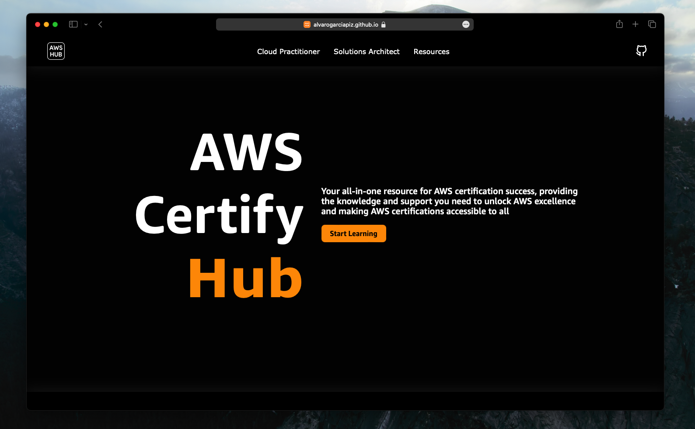

# AWS Certify Hub
Your all-in-one resource for AWS certification success, providing the knowledge and support you need to unlock AWS excellence and making AWS certifications accessible to all.

## Overview

AWS Certify Hub is a web application built with React and Vite, designed to help individuals prepare for AWS certifications, such as AWS Cloud Practitioner. It provides a variety of resources and tools to enhance your certification preparation.

## Features

- **Dark Mode Support:** AWS Certify Hub automatically adapts to your color-scheme preferences of your device.

- **Learning Resources:** Discover a collection of recommended learning resources to help you prepare for your AWS certification.

- **Exam Tips:** Get valuable tips and strategies to perform your best in the certification exam.

- **Exam Structure:** Understand the structure and format of the AWS certification exams.

- **Exam Registration:** Learn how to register for your AWS certification exam.

- **Submit a Question:** Have a question that's not covered? Feel free to submit your own questions, and our community will help you.

- **Exam Simulator:** Practice for your AWS certification exams with our interactive exam simulator.

- **Exam Practice:** Access a set of practice exams to test your knowledge.

- **Error Tests:** Review and retake tests that focus on the questions you previously answered incorrectly.

## Exams

- **Cloud Practitioner:** Practice and errors test available, exam simulator coming soon.

- **Solutions Architect:** Coming soon.

## Contributing

We welcome contributions from the community! If you'd like to contribute to AWS Certify Hub, please follow these guidelines:

1. Fork the repository.
2. Create a new branch for your feature or bug fix: `git checkout -b feature/your-feature-name`.
3. Make your changes and ensure they are properly tested.
4. Commit your changes: `git commit -m "Add your commit message"`.
5. Push to your fork: `git push origin feature/your-feature-name`.
6. Create a pull request, explaining your changes and their benefits.

## Project Structure

## License

This project is licensed under the AGPL-3.0 license.

<!-- ## Deploy to Github pages
`npm run deploy` -->